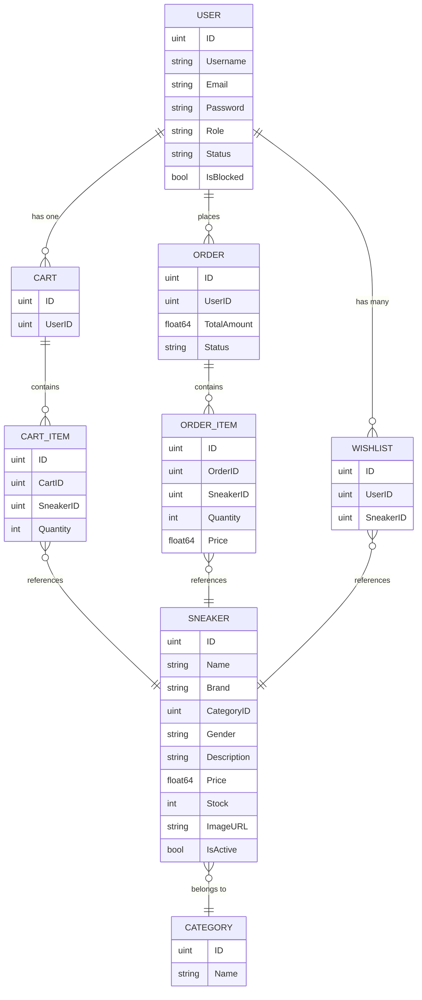

# 🏪 SneaCave — Go E-Commerce Platform

A full-featured e-commerce REST API and admin panel built with **Go**, **Gin**, **GORM**, and **PostgreSQL**.
Designed around a sneaker marketplace theme, the architecture is generic enough for any product-based store.

> **Repository:** [github.com/muhammedfazall/go-ecommerce](https://github.com/muhammedfazall/go-ecommerce.git)

---

## 📑 Table of Contents
- [Tech Stack](#-tech-stack)
- [Architecture](#-architecture)
- [Project Structure](#-project-structure)
- [Data Models](#-data-models)
- [API Reference](#-api-reference)
- [Admin Panel](#-admin-panel)
- [Authentication & Security](#-authentication--security)
- [Getting Started](#-getting-started)
- [Environment Variables](#-environment-variables)
- [Current Status & Known Gaps](#-current-status--known-gaps)

---

## 🛠 Tech Stack

| Layer           | Technology                                                        |
| --------------- | ----------------------------------------------------------------- |
| Language        | Go 1.25+                                                          |
| Web Framework   | [Gin](https://github.com/gin-gonic/gin) v1.11                     |
| ORM             | [GORM](https://gorm.io/) v1.31 with PostgreSQL driver             |
| Database        | PostgreSQL 16                                                     |
| Cache           | Redis 7                                                           |
| Authentication  | JWT (HS256, 60-min expiry) via `golang-jwt/jwt/v5`                |
| Password Hash   | bcrypt (`golang.org/x/crypto`)                                    |
| CORS            | `gin-contrib/cors`                                                |
| Template Engine | `gin-contrib/multitemplate` (admin HTML pages)                    |
| Charts          | Chart.js (embedded in admin dashboard template)                   |
| Config          | `.env` via `godotenv`                                             |
| Containerization| Docker + Docker Compose                                           |

---

## 🏗 Architecture

The project follows a **clean layered architecture** inspired by Go community best practices:

```
cmd/server/main.go          → Application entry point
config/                     → Environment config loader
internal/
  ├── database/             → DB connection, auto-migration, admin seeding
  ├── models/               → GORM model definitions (8 models)
  ├── controllers/          → HTTP handlers (14 controller files)
  ├── services/             → Business logic (auth service)
  ├── middlewares/          → JWT auth + admin role guard
  ├── helpers/              → Password hashing utilities
  └── routes/               → Centralized route registration
utils/
  ├── jwt/                  → JWT generation & validation
  └── otp/                  → (reserved for future OTP)
templates/                  → Server-rendered admin panel (15 HTML files)
```

**Key design decisions:**

- **`internal/` package fence** — prevents external imports, enforcing encapsulation
- **Global `database.DB`** — singleton GORM instance shared across packages
- **Auto-migration on startup** — `database.Migrate()` keeps the schema in sync
- **Seed admin** — `SeedAdmin()` creates a default `superadmin` user on first run
- **Dual API surface** — JSON REST APIs for users/frontend + server-rendered HTML for admin panel

---

## 📊 Data Models



**Relationships:**
- Each `User` has at most one `Cart` (unique index on `UserID`)
- `Wishlist` uses a composite unique index `(UserID, SneakerID)` to prevent duplicates
- `OrderItem` and `CartItem` cascade-delete when their parent is removed
- All models embed `gorm.Model` (provides `ID`, `CreatedAt`, `UpdatedAt`, `DeletedAt` with soft delete)

---

## 📡 API Reference

### Public Endpoints (No Auth)

| Method | Path                       | Description                                          |
| ------ | -------------------------- | ---------------------------------------------------- |
| GET    | `/collections`             | List all products (paginated, filterable, sortable)  |
| GET    | `/products/:id`            | Product details                                      |
| GET    | `/categories`              | List all categories                                  |
| GET    | `/categories/:id/products` | Products by category (paginated)                     |
| GET    | `/products/search`         | Search products by name/brand/description            |

### Auth Endpoints

| Method | Path             | Description                                              |
| ------ | ---------------- | -------------------------------------------------------- |
| POST   | `/auth/register` | Register new user (JSON: username, email, password)      |
| POST   | `/auth/login`    | Login (JSON: email, password) → JWT cookie + token       |
| POST   | `/auth/logout`   | Logout (clears cookie)                                   |

### User-Protected Endpoints (JWT Required)

#### Profile
| Method | Path            | Description      |
| ------ | --------------- | ---------------- |
| GET    | `/user/profile` | Get user profile |

#### Wishlist
| Method | Path                          | Description             |
| ------ | ----------------------------- | ----------------------- |
| POST   | `/wishlist/add`               | Add product to wishlist |
| GET    | `/wishlist`                   | Get wishlist            |
| DELETE | `/wishlist/remove/:productId` | Remove from wishlist    |

#### Cart
| Method | Path                      | Description           |
| ------ | ------------------------- | --------------------- |
| POST   | `/cart/add`               | Add to cart           |
| GET    | `/cart`                   | View cart with total  |
| PUT    | `/cart/update`            | Update item quantity  |
| DELETE | `/cart/remove/:productId` | Remove item from cart |
| DELETE | `/cart/clear`             | Clear entire cart     |

#### Orders
| Method | Path          | Description                                              |
| ------ | ------------- | -------------------------------------------------------- |
| POST   | `/orders`     | Place order (from cart, with stock validation + DB tx)   |
| GET    | `/orders`     | Get my orders                                            |
| GET    | `/orders/:id` | Order details with items                                 |

#### Payments
| Method | Path               | Description                               |
| ------ | ------------------ | ----------------------------------------- |
| POST   | `/payments/create` | Create payment (currently mock)           |
| POST   | `/payments/verify` | Verify payment (manual success/fail flag) |

### Admin Endpoints (JWT + Admin Role Required)

| Method | Path                         | Description                        |
| ------ | ---------------------------- | ---------------------------------- |
| GET    | `/admin/login`               | Login page (HTML)                  |
| POST   | `/admin/login`               | Admin login (form POST)            |
| GET    | `/admin/dashboard`           | Dashboard with stats & chart       |
| GET    | `/admin/products`            | Product list (searchable)          |
| GET    | `/admin/products/new`        | Add product form                   |
| POST   | `/admin/products/new`        | Create product                     |
| GET    | `/admin/products/:id`        | View product                       |
| GET    | `/admin/products/:id/edit`   | Edit product form                  |
| POST   | `/admin/products/:id/edit`   | Update product                     |
| POST   | `/admin/products/:id/delete` | Delete product                     |
| GET    | `/admin/users`               | User list (search/filter)          |
| POST   | `/admin/users/:id/block`     | Toggle block/unblock               |
| POST   | `/admin/users/:id/role`      | Change user role                   |
| GET    | `/admin/categories`          | Category list                      |
| POST   | `/admin/categories`          | Create category                    |
| GET    | `/admin/orders`              | All orders (filter by status/date) |
| GET    | `/admin/orders/:id`          | Order details                      |
| POST   | `/admin/orders/:id/status`   | Update order status                |
| GET    | `/admin/admins`              | List admins                        |
| GET    | `/admin/profile`             | Admin profile                      |
| GET    | `/admin/profile/edit`        | Edit profile form                  |
| POST   | `/admin/profile/update`      | Update profile                     |
| GET    | `/admin/password-change`     | Change password form               |
| POST   | `/admin/password-change`     | Change password                    |
| GET    | `/admin/logout`              | Admin logout                       |

---

## 🖥 Admin Panel

The admin panel is a **server-side rendered** interface using Go's `html/template` with a shared base layout (`admin_base.html`). It includes:

- **Dashboard** — Total users, orders, products, revenue stats + Chart.js 7-day sales graph
- **Product Management** — Full CRUD with search
- **User Management** — List, search, filter by status/blocked, toggle block, change roles
- **Order Management** — List with status/date filters, view details, update status (`pending → paid → shipped → delivered → cancelled`)
- **Category Management** — List and create
- **Admin Profile** — View, edit username/email, change password
- **Admin List** — View all admin users

---

## 🔐 Authentication & Security

| Feature          | Implementation                                                          |
| ---------------- | ----------------------------------------------------------------------- |
| Password Storage | bcrypt hash with default cost                                           |
| Token Format     | JWT (HS256) with `user_id`, `email`, `role` claims                      |
| Token Expiry     | 60 minutes                                                              |
| Token Delivery   | HTTP-only cookie (`access_token`) + JSON response body                  |
| Auth Middleware  | Reads cookie first, falls back to `Authorization: Bearer` header        |
| Admin Guard      | Stacked middleware: `AuthMiddleware()` → `AdminMiddleware()`            |
| Blocked Users    | Checked at login time — blocked users cannot authenticate               |
| CORS             | Configured for `http://127.0.0.1:5500` (dev frontend)                  |

---

## 🚀 Getting Started

### Prerequisites

- [Docker Desktop](https://www.docker.com/products/docker-desktop/) installed and running

---

### 1. Clone the repository

```bash
git clone https://github.com/muhammedfazall/go-ecommerce.git
cd go-ecommerce
```

### 2. Set up environment variables

```bash
cp .env.example .env
```

Open `.env` and fill in your values — at minimum set `JWT_SECRET`, `ADMIN_EMAIL`, and `ADMIN_PASSWORD`.

> Generate a strong JWT secret: `openssl rand -hex 32`

### 3. Start the stack

```bash
docker compose up --build -d
```

This starts the Go app, PostgreSQL, and Redis together. The app will be available at **http://localhost:8080**.

### 4. Seed the database

On first run the database is empty. Run the seed file to populate categories, products, users, orders, carts, and wishlists:

**Mac/Linux:**
```bash
cat scripts/seed_all.sql | docker compose exec -T postgres psql -U sneacave_user -d sneacave_db
```

**Windows (PowerShell):**
```powershell
Get-Content scripts/seed_all.sql | docker compose exec -T postgres psql -U sneacave_user -d sneacave_db
```

This inserts:
- 5 categories
- 100 sneaker products
- 10 sample users (password: `password123`)
- Sample carts, cart items, wishlists, orders, and order items

### 5. Log in to the admin panel

Visit **http://localhost:8080/admin/login**

Use the credentials you set in `.env` via `ADMIN_EMAIL` and `ADMIN_PASSWORD`.

---

### Useful Docker Commands

```bash
# Start all services in background
docker compose up -d

# View live app logs
docker compose logs -f app

# Stop all services
docker compose down

# Stop and wipe the database (clean slate)
docker compose down -v

# Rebuild after code changes
docker compose up --build -d
```

---

### Sample User Accounts (after seeding)

| Email                | Password      | Status   |
| -------------------- | ------------- | -------- |
| john@example.com     | password123   | Active   |
| jane@example.com     | password123   | Active   |
| mike@example.com     | password123   | Active   |
| sarah@example.com    | password123   | Active   |
| chris@example.com    | password123   | Blocked  |

> ⚠️ These are for development only. Never use weak passwords in production.

---

## ⚙ Environment Variables

| Variable         | Description              | Default         |
| ---------------- | ------------------------ | --------------- |
| `DB_HOST`        | PostgreSQL host          | `postgres`      |
| `DB_PORT`        | PostgreSQL port          | `5432`          |
| `DB_USER`        | Database user            | `sneacave_user` |
| `DB_PASSWORD`    | Database password        | —               |
| `DB_NAME`        | Database name            | `sneacave_db`   |
| `DB_SSLMODE`     | SSL mode                 | `disable`       |
| `JWT_SECRET`     | HMAC secret for JWT      | —               |
| `REDIS_ADDR`     | Redis address            | `redis:6379`    |
| `REDIS_PASSWORD` | Redis password           | *(empty)*       |
| `REDIS_DB`       | Redis DB index           | `0`             |

> Generate a strong JWT secret: `openssl rand -hex 32`

---

## ⚠ Current Status & Known Gaps

### ✅ What's Working

- Complete user authentication flow (register, login, logout)
- Full product catalog with pagination, filtering, sorting, and search
- Shopping cart (add, view, update quantity, remove, clear)
- Order placement with **database transactions** and **row-level locking** for stock validation
- Wishlist management
- Full admin panel with dashboard, product CRUD, user management, order management, categories
- Admin profile management with password change
- JWT-based auth with cookie and header support
- CORS configured for frontend integration
- **Fully containerized with Docker + Docker Compose** (one-command setup)

### 🔴 Known Gaps & Planned Improvements

| Area              | Issue                                                                    |
| ----------------- | ------------------------------------------------------------------------ |
| **OTP**           | `utils/otp/` directory exists but is empty — no implementation           |
| **Payment**       | Payment is **mocked** (fake payment ID, manual success/fail flag)        |
| **Email**         | No email service — no signup confirmation, no OTP, no password reset     |
| **Redis**         | Redis is running but not yet used for caching or session management      |
| **CI/CD**         | No GitHub Actions or CI/CD pipeline                                      |
| **Testing**       | No unit tests, integration tests, or test setup                          |
| **Logging**       | Basic `log.Println` — no structured logging                              |
| **Validation**    | Minimal input validation (no email format check, no password strength)   |
| **Refresh Token** | No refresh token — users must re-login after 60 minutes                  |
| **Rate Limiting** | No rate limiting on auth endpoints                                       |
| **File Upload**   | Products use `ImageURL` string — no actual file upload support           |
| **Pagination**    | No total count returned — frontend can't build page navigation           |
| **Soft Delete**   | GORM soft delete is active but product listing doesn't filter `is_active`|
| **Error Handling**| Direct DB errors sometimes leak to API responses                         |

