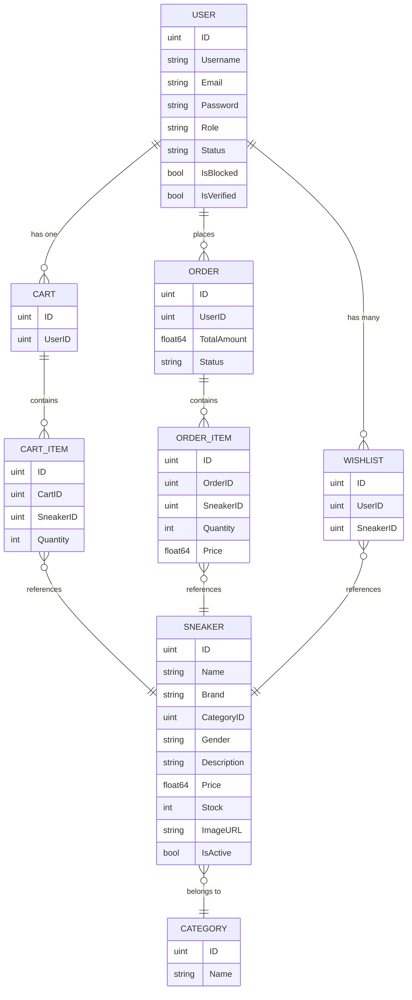

# 🏪 SneaCave — Go E-Commerce Platform

A full-featured e-commerce REST API and admin panel built with **Go**, **Gin**, **GORM**, and **PostgreSQL**.
Designed around a sneaker marketplace theme, the architecture is generic enough for any product-based store.

> **Repository:** [github.com/muhammedfazall/go-ecommerce](https://github.com/muhammedfazall/go-ecommerce.git)

---

## 📑 Table of Contents
- [Tech Stack](#-tech-stack)
- [Architecture](#-architecture)
- [Project Structure](#-project-structure)
- [Data Models](#-data-models)
- [API Reference](#-api-reference)
- [Admin Panel](#-admin-panel)
- [Authentication & Security](#-authentication--security)
- [Email & OTP Verification](#-email--otp-verification)
- [CI/CD Pipeline](#-cicd-pipeline)
- [Getting Started](#-getting-started)
- [Environment Variables](#-environment-variables)
- [Current Status & Known Gaps](#-current-status--known-gaps)

---

## 🛠 Tech Stack

| Layer           | Technology                                                        |
| --------------- | ----------------------------------------------------------------- |
| Language        | Go 1.25+                                                          |
| Web Framework   | [Gin](https://github.com/gin-gonic/gin) v1.11                     |
| ORM             | [GORM](https://gorm.io/) v1.31 with PostgreSQL driver             |
| Database        | PostgreSQL 16                                                     |
| Cache / Store   | Redis 7 (refresh tokens, OTP storage, token blacklisting)         |
| Authentication  | JWT (HS256) — 15-min access token + 7-day refresh token           |
| Password Hash   | bcrypt (`golang.org/x/crypto`)                                    |
| Email           | SMTP via [`gomail.v2`](https://pkg.go.dev/gopkg.in/gomail.v2)     |
| CORS            | `gin-contrib/cors`                                                |
| Template Engine | `gin-contrib/multitemplate` (admin HTML pages)                    |
| Charts          | Chart.js (embedded in admin dashboard template)                   |
| Config          | `.env` via `godotenv`                                             |
| Containerization| Docker + Docker Compose                                           |
| CI/CD           | GitHub Actions (test → build → push to Docker Hub)                |

---

## 🏗 Architecture

The project follows a **clean layered architecture** inspired by Go community best practices:

```
cmd/server/main.go          → Application entry point
config/                     → Environment config loader
internal/
  ├── cache/                → Redis client connection
  ├── database/             → DB connection, auto-migration, admin seeding
  ├── email/                → SMTP email service (welcome + OTP emails)
  ├── models/               → GORM model definitions (8 models)
  ├── controllers/          → HTTP handlers (15 controller files)
  ├── services/             → Business logic (auth service)
  ├── middlewares/           → JWT auth + blacklist check + admin role guard
  ├── helpers/              → Password hashing utilities
  └── routes/               → Centralized route registration
utils/
  ├── jwt/                  → JWT access + refresh token lifecycle (Redis-backed)
  └── otp/                  → OTP generation, Redis storage & verification
templates/                  → Server-rendered admin panel (15 HTML files)
.github/workflows/ci.yml   → CI/CD pipeline
```

**Key design decisions:**

- **`internal/` package fence** — prevents external imports, enforcing encapsulation
- **Global `database.DB`** — singleton GORM instance shared across packages
- **Auto-migration on startup** — `database.Migrate()` keeps the schema in sync
- **Seed admin** — `SeedAdmin()` creates a default `superadmin` user on first run
- **Dual API surface** — JSON REST APIs for users/frontend + server-rendered HTML for admin panel
- **Redis as active infrastructure** — used for refresh token storage, OTP TTL, and access token blacklisting
- **Two-phase registration** — users register with `pending` status, then verify email via OTP to activate

---

## 📊 Data Models



**Relationships:**
- Each `User` has at most one `Cart` (unique index on `UserID`)
- `Wishlist` uses a composite unique index `(UserID, SneakerID)` to prevent duplicates
- `OrderItem` and `CartItem` cascade-delete when their parent is removed
- All models embed `gorm.Model` (provides `ID`, `CreatedAt`, `UpdatedAt`, `DeletedAt` with soft delete)
- `User.IsVerified` tracks email verification status; new users default to `Status: "pending"`, `IsVerified: false`

---

## 📡 API Reference

### Public Endpoints (No Auth)

| Method | Path                       | Description                                          |
| ------ | -------------------------- | ---------------------------------------------------- |
| GET    | `/health`                  | Health check (returns `{"status":"ok"}`)             |
| GET    | `/collections`             | List all products (paginated, filterable, sortable)  |
| GET    | `/products/:id`            | Product details                                      |
| GET    | `/categories`              | List all categories                                  |
| GET    | `/categories/:id/products` | Products by category (paginated)                     |
| GET    | `/products/search`         | Search products by name/brand/description            |

### Auth Endpoints

| Method | Path               | Description                                                      |
| ------ | ------------------ | ---------------------------------------------------------------- |
| POST   | `/auth/register`   | Register new user → sends OTP email for verification             |
| POST   | `/auth/verify-otp` | Verify OTP → activates account + sends welcome email             |
| POST   | `/auth/resend-otp` | Resend a fresh OTP to the user's email                           |
| POST   | `/auth/login`      | Login → returns access token (cookie) + refresh token (cookie)   |
| POST   | `/auth/logout`     | Logout — blacklists access token, deletes refresh token in Redis |
| POST   | `/auth/refresh`    | Refresh access token using refresh token (with rotation)         |

### User-Protected Endpoints (JWT Required)

#### Profile
| Method | Path            | Description      |
| ------ | --------------- | ---------------- |
| GET    | `/user/profile` | Get user profile |

#### Wishlist
| Method | Path                          | Description             |
| ------ | ----------------------------- | ----------------------- |
| POST   | `/wishlist/add`               | Add product to wishlist |
| GET    | `/wishlist`                   | Get wishlist            |
| DELETE | `/wishlist/remove/:productId` | Remove from wishlist    |

#### Cart
| Method | Path                      | Description           |
| ------ | ------------------------- | --------------------- |
| POST   | `/cart/add`               | Add to cart           |
| GET    | `/cart`                   | View cart with total  |
| PUT    | `/cart/update`            | Update item quantity  |
| DELETE | `/cart/remove/:productId` | Remove item from cart |
| DELETE | `/cart/clear`             | Clear entire cart     |

#### Orders
| Method | Path          | Description                                              |
| ------ | ------------- | -------------------------------------------------------- |
| POST   | `/orders`     | Place order (from cart, with stock validation + DB tx)   |
| GET    | `/orders`     | Get my orders                                            |
| GET    | `/orders/:id` | Order details with items                                 |

#### Payments
| Method | Path               | Description                               |
| ------ | ------------------ | ----------------------------------------- |
| POST   | `/payments/create` | Create payment (currently mock)           |
| POST   | `/payments/verify` | Verify payment (manual success/fail flag) |

### Admin Endpoints (JWT + Admin Role Required)

| Method | Path                         | Description                        |
| ------ | ---------------------------- | ---------------------------------- |
| GET    | `/admin/login`               | Login page (HTML)                  |
| POST   | `/admin/login`               | Admin login (form POST)            |
| GET    | `/admin/dashboard`           | Dashboard with stats & chart       |
| GET    | `/admin/products`            | Product list (searchable)          |
| GET    | `/admin/products/new`        | Add product form                   |
| POST   | `/admin/products/new`        | Create product                     |
| GET    | `/admin/products/:id`        | View product                       |
| GET    | `/admin/products/:id/edit`   | Edit product form                  |
| POST   | `/admin/products/:id/edit`   | Update product                     |
| POST   | `/admin/products/:id/delete` | Delete product                     |
| GET    | `/admin/users`               | User list (search/filter)          |
| POST   | `/admin/users/:id/block`     | Toggle block/unblock               |
| POST   | `/admin/users/:id/role`      | Change user role                   |
| GET    | `/admin/categories`          | Category list                      |
| POST   | `/admin/categories`          | Create category                    |
| GET    | `/admin/orders`              | All orders (filter by status/date) |
| GET    | `/admin/orders/:id`          | Order details                      |
| POST   | `/admin/orders/:id/status`   | Update order status                |
| GET    | `/admin/admins`              | List admins                        |
| GET    | `/admin/profile`             | Admin profile                      |
| GET    | `/admin/profile/edit`        | Edit profile form                  |
| POST   | `/admin/profile/update`      | Update profile                     |
| GET    | `/admin/password-change`     | Change password form               |
| POST   | `/admin/password-change`     | Change password                    |
| GET    | `/admin/logout`              | Admin logout                       |

---

## 🖥 Admin Panel

The admin panel is a **server-side rendered** interface using Go's `html/template` with a shared base layout (`admin_base.html`). It includes:

- **Dashboard** — Total users, orders, products, revenue stats + Chart.js 7-day sales graph
- **Product Management** — Full CRUD with search
- **User Management** — List, search, filter by status/blocked, toggle block, change roles
- **Order Management** — List with status/date filters, view details, update status (`pending → paid → shipped → delivered → cancelled`)
- **Category Management** — List and create
- **Admin Profile** — View, edit username/email, change password
- **Admin List** — View all admin users

---

## 🔐 Authentication & Security

| Feature                | Implementation                                                                     |
| ---------------------- | ---------------------------------------------------------------------------------- |
| Password Storage       | bcrypt hash with default cost                                                      |
| Access Token           | JWT (HS256) with `user_id`, `email`, `role` claims — **15-minute** expiry          |
| Refresh Token          | Cryptographically random 256-bit string — **7-day** expiry, stored in Redis        |
| Token Rotation         | On refresh, old token is replaced — one active refresh token per user              |
| Token Delivery         | HTTP-only cookies (`access_token` scoped to `/`, `refresh_token` scoped to `/auth/refresh`) |
| Token Blacklisting     | On logout, access token SHA-256 hash is stored in Redis (TTL = token lifetime)     |
| Auth Middleware        | Reads cookie first, falls back to `Authorization: Bearer` header; checks blacklist |
| Verification Guard     | Middleware rejects requests from unverified (`IsVerified: false`) users             |
| Admin Guard            | Stacked middleware: `AuthMiddleware()` → `AdminMiddleware()`                       |
| Blocked Users          | Checked both at login and per-request via middleware                                |
| Constant-Time Compare  | Refresh token validation uses `crypto/subtle.ConstantTimeCompare`                  |
| CORS                   | Configured for `http://127.0.0.1:5500` (dev frontend)                             |

---

## 📧 Email & OTP Verification

The platform implements a **two-phase registration** flow:

1. **Register** → User created with `status: "pending"`, `is_verified: false`
2. **OTP Sent** → A 6-digit OTP is generated securely (`crypto/rand`), stored in Redis with a **5-minute TTL**, and emailed via SMTP
3. **Verify OTP** → On successful verification, user is activated (`status: "active"`, `is_verified: true`) and a welcome email is sent (non-blocking, via goroutine)
4. **Resend OTP** → Available for users who haven't verified yet

**Email Templates:**
- **OTP verification email** — Contains the 6-digit code with expiry notice
- **Welcome email** — Sent after successful verification

**SMTP Configuration:** Uses `gomail.v2` with configurable SMTP host, port, credentials, and sender address via environment variables.

---

## 🔄 CI/CD Pipeline

The project uses **GitHub Actions** (`.github/workflows/ci.yml`) with two jobs:

### Test Job (on every push & PR to `main`)
- Spins up PostgreSQL 16 and Redis 7 as service containers
- Sets up Go 1.25 with module caching
- Runs `go test ./... -v -coverprofile=coverage.out`
- Uploads coverage to Codecov

### Build & Push Job (on push to `main` only, after tests pass)
- Builds the Docker image using Docker Buildx
- Pushes to Docker Hub as `muhammedfazall/sneacave:latest` and `muhammedfazall/sneacave:<commit-sha>`
- Uses GitHub Actions cache for Docker layer caching

---

## 🚀 Getting Started

### Prerequisites

- [Docker Desktop](https://www.docker.com/products/docker-desktop/) installed and running

---

### 1. Clone the repository

```bash
git clone https://github.com/muhammedfazall/go-ecommerce.git
cd go-ecommerce
```

### 2. Set up environment variables

```bash
cp .env.example .env
```

Open `.env` and fill in your values — at minimum set `JWT_SECRET`, `ADMIN_EMAIL`, `ADMIN_PASSWORD`, and the SMTP credentials for email functionality.

> Generate a strong JWT secret: `openssl rand -hex 32`

### 3. Start the stack

```bash
docker compose up --build -d
```

This starts the Go app, PostgreSQL, and Redis together. The app will be available at **http://localhost:8080**.

### 4. Verify the stack is healthy

```bash
curl http://localhost:8080/health
# → {"status":"ok"}
```

### 5. Seed the database

On first run the database is empty. Run the seed file to populate categories, products, users, orders, carts, and wishlists:

**Mac/Linux:**
```bash
cat scripts/seed_all.sql | docker compose exec -T postgres psql -U sneacave_user -d sneacave_db
```

**Windows (PowerShell):**
```powershell
Get-Content scripts/seed_all.sql | docker compose exec -T postgres psql -U sneacave_user -d sneacave_db
```

This inserts:
- 5 categories
- 100 sneaker products
- 10 sample users (password: `password123`)
- Sample carts, cart items, wishlists, orders, and order items

### 6. Log in to the admin panel

Visit **http://localhost:8080/admin/login**

Use the credentials you set in `.env` via `ADMIN_EMAIL` and `ADMIN_PASSWORD`.

---

### 📋 Useful Commands

#### Docker

```bash
# Start all services in background
docker compose up -d

# Start with a fresh build
docker compose up --build -d

# View live app logs
docker compose logs -f app

# View logs for a specific service
docker compose logs -f postgres
docker compose logs -f redis

# Stop all services
docker compose down

# Stop and wipe all data (clean slate)
docker compose down -v

# Restart just the app (after code changes)
docker compose up --build -d app

# Check running containers
docker compose ps

# Shell into the app container
docker compose exec app sh
```

#### Go (local development without Docker)

```bash
# Run the server locally
go run ./cmd/server

# Download dependencies
go mod download

# Tidy up go.mod / go.sum
go mod tidy

# Run all tests
go test ./... -v

# Run tests with coverage
go test ./... -v -coverprofile=coverage.out
go tool cover -html=coverage.out

# Build the binary
go build -o server ./cmd/server

# Vet and lint
go vet ./...
```

#### Database (PostgreSQL)

```bash
# Open a psql shell inside the container
docker compose exec postgres psql -U sneacave_user -d sneacave_db

# Run the seed file (Mac/Linux)
cat scripts/seed_all.sql | docker compose exec -T postgres psql -U sneacave_user -d sneacave_db

# Run the seed file (Windows PowerShell)
Get-Content scripts/seed_all.sql | docker compose exec -T postgres psql -U sneacave_user -d sneacave_db

# List all tables
docker compose exec postgres psql -U sneacave_user -d sneacave_db -c "\dt"

# Quick row counts
docker compose exec postgres psql -U sneacave_user -d sneacave_db -c "SELECT 'users' AS t, COUNT(*) FROM users UNION ALL SELECT 'sneakers', COUNT(*) FROM sneakers UNION ALL SELECT 'orders', COUNT(*) FROM orders;"

# Dump the database
docker compose exec postgres pg_dump -U sneacave_user sneacave_db > backup.sql
```

#### Redis

```bash
# Open a Redis CLI shell
docker compose exec redis redis-cli

# List all keys
docker compose exec redis redis-cli KEYS "*"

# Check stored refresh tokens
docker compose exec redis redis-cli KEYS "refresh:*"

# Check stored OTPs
docker compose exec redis redis-cli KEYS "otp:*"

# Check blacklisted tokens
docker compose exec redis redis-cli KEYS "blacklist:*"

# Flush all Redis data
docker compose exec redis redis-cli FLUSHALL
```

#### API Testing (curl)

```bash
# Health check
curl http://localhost:8080/health

# Register a new user
curl -X POST http://localhost:8080/auth/register \
  -H "Content-Type: application/json" \
  -d '{"username":"testuser","email":"test@example.com","password":"securepass123"}'

# Verify OTP
curl -X POST http://localhost:8080/auth/verify-otp \
  -H "Content-Type: application/json" \
  -d '{"email":"test@example.com","otp":"123456"}'

# Login (saves cookies to cookiejar)
curl -X POST http://localhost:8080/auth/login \
  -H "Content-Type: application/json" \
  -d '{"email":"test@example.com","password":"securepass123"}' \
  -c cookies.txt

# Access a protected endpoint (using saved cookies)
curl http://localhost:8080/user/profile -b cookies.txt

# Refresh token
curl -X POST http://localhost:8080/auth/refresh -b cookies.txt -c cookies.txt

# Browse products
curl "http://localhost:8080/collections?page=1&limit=10"

# Search products
curl "http://localhost:8080/products/search?q=nike"

# Logout
curl -X POST http://localhost:8080/auth/logout -b cookies.txt
```

---

### Sample User Accounts (after seeding)

| Email                | Password      | Status   |
| -------------------- | ------------- | -------- |
| john@example.com     | password123   | Active   |
| jane@example.com     | password123   | Active   |
| mike@example.com     | password123   | Active   |
| sarah@example.com    | password123   | Active   |
| chris@example.com    | password123   | Blocked  |

> ⚠️ These are for development only. Never use weak passwords in production.

---

## ⚙ Environment Variables

| Variable         | Description              | Default         |
| ---------------- | ------------------------ | --------------- |
| `DB_HOST`        | PostgreSQL host          | `postgres`      |
| `DB_PORT`        | PostgreSQL port          | `5432`          |
| `DB_USER`        | Database user            | `sneacave_user` |
| `DB_PASSWORD`    | Database password        | —               |
| `DB_NAME`        | Database name            | `sneacave_db`   |
| `DB_SSLMODE`     | SSL mode                 | `disable`       |
| `JWT_SECRET`     | HMAC secret for JWT      | —               |
| `REDIS_ADDR`     | Redis address            | `redis:6379`    |
| `REDIS_PASSWORD` | Redis password           | *(empty)*       |
| `REDIS_DB`       | Redis DB index           | `0`             |
| `ADMIN_EMAIL`    | Default admin email      | —               |
| `ADMIN_PASSWORD` | Default admin password   | —               |
| `SMTP_HOST`      | SMTP server host         | —               |
| `SMTP_PORT`      | SMTP server port         | —               |
| `SMTP_USER`      | SMTP auth username       | —               |
| `SMTP_PASSWORD`  | SMTP auth password       | —               |
| `SMTP_FROM`      | Sender address for emails| —               |

> Generate a strong JWT secret: `openssl rand -hex 32`

---

## ⚠ Current Status & Known Gaps

### ✅ What's Working

- Complete user authentication flow (register → OTP verify → login → refresh → logout)
- **Email verification via OTP** — 6-digit OTP with 5-min Redis TTL, resend support
- **Welcome email** on successful verification (non-blocking)
- **JWT refresh token system** — 15-min access token + 7-day refresh token with rotation
- **Token blacklisting** — logout invalidates access tokens via Redis
- **Redis actively used** — refresh token storage, OTP TTL, token blacklisting
- Full product catalog with pagination, filtering, sorting, and search
- Shopping cart (add, view, update quantity, remove, clear)
- Order placement with **database transactions** and **row-level locking** for stock validation
- Wishlist management
- Full admin panel with dashboard, product CRUD, user management, order management, categories
- Admin profile management with password change
- JWT-based auth with cookie and header support
- CORS configured for frontend integration
- **Fully containerized with Docker + Docker Compose** (one-command setup)
- **CI/CD pipeline** via GitHub Actions (test → build → push Docker image)
- **Health check endpoint** (`GET /health`)

### 🔴 Known Gaps & Planned Improvements

| Area              | Issue                                                                    |
| ----------------- | ------------------------------------------------------------------------ |
| **Payment**       | Payment is **mocked** (fake payment ID, manual success/fail flag)        |
| **Testing**       | No unit tests, integration tests, or test setup                          |
| **Logging**       | Basic `log.Println` — no structured logging                              |
| **Validation**    | Minimal input validation (no email format check, no password strength)   |
| **Rate Limiting** | No rate limiting on auth endpoints                                       |
| **File Upload**   | Products use `ImageURL` string — no actual file upload support           |
| **Pagination**    | No total count returned — frontend can't build page navigation           |
| **Soft Delete**   | GORM soft delete is active but product listing doesn't filter `is_active`|
| **Error Handling**| Direct DB errors sometimes leak to API responses                         |
| **Password Reset**| No forgot-password / reset-password flow                                 |
